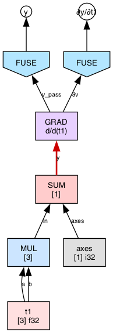
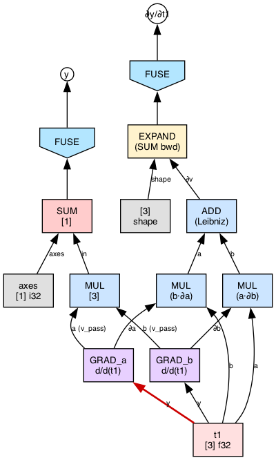
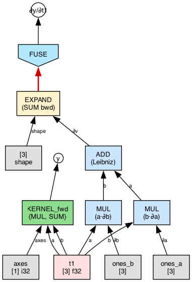
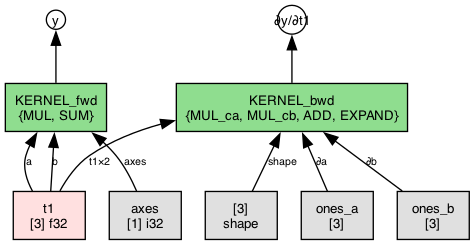

# TinyHVM

Lazy **interaction-net** runtime for tensor programs. Computation is graph rewriting in the style of [HVM4](https://github.com/HigherOrderCO/HVM4); tensor ops and scheduling borrow operational ideas from [tinygrad](https://github.com/tinygrad/tinygrad).

The engine is a single aggregate C translation unit ([`src/tinyhvm.c`](src/tinyhvm.c) includes per-function files from `src/*/`), **no third-party runtime deps** beyond libc and the chosen backend (**Accelerate** on Apple, **Metal** on macOS, **CPU + pthread** on Linux in `build.sh`). Optional wrappers: **Wolfram Language** (`./build.sh --paclet`) and **Python** (`./build.sh --python`).

---

## What you get

- **64-bit packed terms** (`SUB`/`TAG`/`EXT`/`VAL`) for the core calculus plus tensor nodes (`TAG_TEN`, `TAG_TOP`, …) — see [`docs/reduction.md`](docs/reduction.md) for the full layout.
- **Lazy tensor UOps** (matmul, elementwise, reduce, reshape/permute/expand, conv2d, pooling, fused kernels, in-place assign, …) kept as `TAG_TOP` until **`thvm_eval`** runs the scheduler + dispatch.
- **Pluggable backends**: CPU (Accelerate) and **Metal** with JIT-style kernel generation under [`src/backend/metal/`](src/backend/metal/).
- **Autograd without a tape**: backward is expressed as **interaction rules** on the same net (`UOP_GRAD`, `UOP_GRAD_FWD`) — see [`docs/grad.md`](docs/grad.md).
- **Structural fusion** (`UOP_FUSE` → `UOP_KERNEL`) under [`src/fuse/`](src/fuse/) and [`src/interact/tensor_ops.c`](src/interact/tensor_ops.c) — see [`docs/fusion.md`](docs/fusion.md).
- **Active test drivers** (`test/*.m`) that `#include` [`src/tinyhvm.c`](src/tinyhvm.c) directly.

Agent-oriented build and file map: [`AGENTS.md`](AGENTS.md).

---

## How interaction reduction looks

TinyHVM reduces tensor programs as **local graph rewrites**. To make that concrete, here's the canonical VJP trace for `sum((t1 * t1))` differentiated with respect to `t1`, rendered one interaction at a time by `scripts/run_vjp_step_graph.sh png`. The full 10-step walkthrough lives in [`docs/step_graph_ic_goal.md`](docs/step_graph_ic_goal.md).

### Step 0 — initial state

`thvm_grad(sum(t1*t1), t1)` wraps the forward term in a `GRAD` **T-junction** (1-in, 2-out): `y` comes in on the principal port; `v_pass` carries the forward value to a forward `FUSE_f`; `∂v` carries the cotangent to a backward `FUSE_b`. The red edge is the redex about to fire.



### Step 2 — `GRAD ⊳ MUL` has just split into two sub-GRADs

Binary Leibniz: each operand of `MUL` gets its own sub-GRAD; each sub-GRAD's `v_pass` feeds the original forward `MUL`, and each `∂v` feeds a **chain MUL** that multiplies the cotangent by the *other* operand. `ADD_leib` sums the two chain MULs back into `∂v` for the parent node. `t1` is a TEN atom — aliased into all four consumers without a DUP.



### Step 7 — forward kernels merged

`FUSE_f` has absorbed `SUM` and `MUL` into `KERNEL_fwd`.  The backward subtree is still raw compute TOPs; `EXPAND → FUSE_b` is the next redex.



### Step 9 — final WHNF

Both sweeps have settled into exactly two kernels: `KERNEL_fwd = {MUL, SUM}` producing `y` and `KERNEL_bwd = {MUL_ca, MUL_cb, ADD, EXPAND}` producing `∂y/∂t1`.  Running them yields `y = [14]` and `∂y/∂t1 = [2, 4, 6]`.



Each step is one interaction rule firing through the WNF stack machine
([`src/wnf/_.c`](src/wnf/_.c)); the per-interaction hook snapshots the
heap after every fire.  Enable it with `THVM_STEP_GRAPH=1`; see
[`docs/step_trampoline.md`](docs/step_trampoline.md).

---

## Build

Everything, including paclet + python:

```bash
./build.sh --all
```

Per-binary build (compiles test drivers from `test/*.m` into `bin/`):

```bash
./build.sh
```

Metal shader library (once):

```bash
make shaders.metallib
```

Wolfram paclet:

```bash
./build.sh --paclet
```

Then in Wolfram:

```wolfram
PacletDirectoryLoad["/absolute/path/to/TinyHVM"];
Get["TinyHVM`"]
TInit["metal"]
```

Profiling: set `THVM_PROFILE=1` to enable step-level UOp timing (see `ThvmProfile` in [`src/tinyhvm.h`](src/tinyhvm.h)).  Full env-var reference: [`docs/env.md`](docs/env.md).

---

## C API sketch

Tests are plain C inside `.m` files; they `#include "../src/tinyhvm.c"` plus backends.

- **`Tensor` + `Linear`** ([`src/nn/tensor_api.c`](src/nn/tensor_api.c), declarations in [`src/tinyhvm.h`](src/tinyhvm.h)) — concise C wrappers over lazy terms: `tensor_matmul` / `tensor_add` / `tensor_mul` / `tensor_relu` / `tensor_sum_axes` / `tensor_conv2d` / `tensor_maxpool2d` / `tensor_batchnorm` / `tensor_softmax` / `tensor_cross_entropy`, plus `linear_forward`.
- **`thvm_tg_*`** ([`src/nn/tg_tensor.c`](src/nn/tg_tensor.c)) is the lower-level tinygrad-shaped bridge (`Tensor.linear`/`dot` semantics).
- **`Layer` + `thvm_sequential`** ([`src/tinyhvm.h`](src/tinyhvm.h), [`src/nn/sequential.c`](src/nn/sequential.c)) stacks CNN-style layers (conv, batchnorm, maxpool, flatten, linear, custom `LayerFn`).
- **Python surface** keeps the same concise names (`tinyhvm.Tensor`, `tinyhvm.nn.Linear`) in [`py/tinyhvm/tensor.py`](py/tinyhvm/tensor.py) and [`py/tinyhvm/nn/__init__.py`](py/tinyhvm/nn/__init__.py).

Lazy tensor compute stays **inet-normal** until you **`thvm_eval`** the term you want realized (scheduler + Metal/CPU dispatch inside the TU). Then **`thvm_to_host`** reads a concrete buffer.

**Forward: `relu(linear(x, w, b))`**

```c
TinyHVM *ctx = thvm_init("metal");  // or "cpu"

f32 x_d[] = {1,2,3,4,5,6}; u32 xs[] = {2,3};
f32 w_d[] = {0.1f,-0.2f, 0.3f,0.4f, -0.5f,0.6f}; u32 ws[] = {3,2};
f32 b_d[] = {-0.1f, 0.2f}; u32 bs[] = {1,2};

Tensor x = tensor_from_f32(ctx, x_d, shape_of(xs, 2));
Tensor w = tensor_from_f32(ctx, w_d, shape_of(ws, 2));
Tensor b = tensor_from_f32(ctx, b_d, shape_of(bs, 2));
Linear lin = {.weight = w, .bias = b, .has_bias = 1};

Tensor y = linear_forward(&lin, x);
Tensor result = tensor_realize(tensor_relu(y));
f32 *out = tensor_to_host_f32(result);
/* out ≈ [0, 2.6, 0, 5.0] */
thvm_free(ctx);
```

**Autograd: `sum(relu(x * w))` w.r.t. `w`**

```c
TinyHVM *ctx = thvm_init("metal");

f32 xd[] = {1,2,3, 4,5,6};
f32 wd[] = {0.1f, 0.2f, 0.3f};
Tensor x = tensor_from_f32(ctx, xd, (Shape){.dims={2,3}, .rank=2});
Tensor w = tensor_from_f32(ctx, wd, (Shape){.dims={3}, .rank=1});
thvm_set_requires_grad(ctx, w.term);

Tensor h = tensor_relu(tensor_mul(x, w));
Tensor loss = tensor_sum_axes(h, (u32[]){0, 1}, 2);
Tensor bundle = tensor_realize(tensor_backward_keep(loss, w));

f32 *dw = tensor_to_host_f32(tensor_bundle_get(bundle, 0));
/* dw ≈ [5, 7, 9] */

thvm_free(ctx);
```

Lower-level inet patterns using `thvm_grad` / `thvm_reduce` still appear in the gradient rule tests (e.g. [`test/test_grad_rules.m`](test/test_grad_rules.m)).  For higher-level lazy backward graphs use `tensor_backward_keep` (or `thvm_grad_bundle` for raw Terms) and `thvm_eval` before readback.

Public declarations live in [`src/tinyhvm.h`](src/tinyhvm.h). `thvm_eval` is in [`src/schedule/_.c`](src/schedule/_.c).

---

## Evaluation stages

`thvm_eval` is a staged pipeline; each arrow below is one pass over the term graph. [`docs/eval.md`](docs/eval.md) walks through them in detail, and [`docs/reduction.md`](docs/reduction.md) covers the underlying stack machine.

```
thvm_reduce       → IC normal form (APP/LAM/IFZ/GRAD/MAT/DUP fire; compute TOPs stay lazy)
thvm_normalize    → deep-WHNF walk (root-reachable; serial WsDeque)
FUSE pass         → FUSE(binary(a,b)) → KERNEL(FUSE(a), FUSE(b), uop)
global passes     → rewrite the settled kernel DAG; install EXEC triggers
second reduce     → fire EXEC / dispatch KERNEL → TEN on demand
```

---

## Where to read next

| Topic | Location |
|--------|-----------|
| Term layout, UOp codes, context struct | [`src/tinyhvm.h`](src/tinyhvm.h) |
| **How reduction works** (heap, stack machine, normalize) | [`docs/reduction.md`](docs/reduction.md) |
| **Canonical VJP step trace** (the pictures above) | [`docs/step_graph_ic_goal.md`](docs/step_graph_ic_goal.md) |
| **Step-graph tracer C ↔ WL bridge** | [`docs/step_trampoline.md`](docs/step_trampoline.md) |
| **Evaluation pipeline** (local + global, FUSE, KERNEL) | [`docs/eval.md`](docs/eval.md) |
| **Gradient semantics** (VJP rules, DUP interaction) | [`docs/grad.md`](docs/grad.md) |
| **Structural fusion** (FUSE → KERNEL) | [`docs/fusion.md`](docs/fusion.md) |
| **Kernel cache + epochs** | [`docs/kernel_cache.md`](docs/kernel_cache.md) |
| **Env vars** (THVM_STEP_GRAPH, THVM_GRAPH, …) | [`docs/env.md`](docs/env.md) |
| Interaction rules | [`src/interact/_.c`](src/interact/_.c), [`src/interact/grad.c`](src/interact/grad.c), [`src/interact/tensor_ops.c`](src/interact/tensor_ops.c), [`src/interact/combinators.c`](src/interact/combinators.c) |
| WNF stack machine | [`src/wnf/_.c`](src/wnf/_.c) |
| Deep-WHNF walker | [`src/parallel/normalize.c`](src/parallel/normalize.c) |
| Scheduler | [`src/schedule/_.c`](src/schedule/_.c) |
| Metal JIT | [`src/backend/metal/codegen.m`](src/backend/metal/codegen.m), [`src/backend/metal/jit.m`](src/backend/metal/jit.m) |
| Tutorial chapters | [`docs/tutorial/`](docs/tutorial/) |
| Design notes | [`resources/`](resources/), [`Notebooks/`](Notebooks/) |

---

## License / attribution

TinyHVM is an independent experiment informed by the HVM interaction-calculus lineage and by tinygrad-style minimal runtimes. See upstream projects for their licenses.
