# Step-graph target: IC-native VJP interaction trace

Goal for the wnf VJP refactor.  Each step is one IC interaction.  The
redex (principal-port edge of the two interacting terms) is drawn red.
All mutations are persistent: a consumed node is ERA'd on the heap, a
new node gets a fresh cell.  No frames, no restore-after-dump hacks.

Dot sources + rendered PNGs live in [step_graph_ic_goal/](step_graph_ic_goal/).

Example: `vjp_sum_of_square`

```c
f32 xd[] = {1, 2, 3};
Term t1 = thvm_tensor(ctx, xd, SHAPE(3));
Term sq = thvm_op(ctx, UOP_MUL, t1, t1);
Term y  = thvm_sum_axes(ctx, sq, (u32[]){0}, 1);
thvm_eval(ctx, thvm_grad(ctx, y, t1));  // expect [2, 4, 6]
```

## GRAD term layout (IC)

A `GRAD` agent has 3 principal input ports and 1 output port:

- `y`  — the forward term being differentiated.
- `tgt` — the target tensor (for leaf-annihilation match).
- `gy` — the cotangent accumulator.  Outermost GRAD is seeded with
  `ones(y.shape)`.
- `out` — the contributed gradient.

The **redex edge** is always the `y→GRAD` edge.  When the term at the
`y` port reduces to a WHNF head, the corresponding VJP rule fires and
rewrites the local neighbourhood.

## Per-rule rewrites

| head at `y`         | rewrite                                                                |
|---------------------|------------------------------------------------------------------------|
| `TEN == tgt`        | GRAD annihilates → `gy` becomes the output.                            |
| `TEN != tgt`        | GRAD annihilates to ERA.                                               |
| `SUM(a, axes)`      | new GRAD with `y=a`, `gy=EXPAND(gy, shape(a))`.                        |
| `MUL(a, b)`         | two sub-GRADs (y=a, y=b); cotangents `MUL(gy, b)` / `MUL(gy, a)`; ADD outputs. |
| `ADD(a, b)`         | two sub-GRADs (y=a, y=b); both share gy via DUP; ADD outputs.          |
| `NEG(a)`            | new GRAD with `y=a`, `gy=NEG(gy)`.                                     |
| `EXP(a)`            | new GRAD with `y=a`, `gy=MUL(gy, EXP(a))` (EXP reuses forward value).  |
| `LOG(a)`            | new GRAD with `y=a`, `gy=DIV(gy, a)`.                                  |
| … (RELU/SQRT/etc.)  | analogous unary wrap.                                                  |

Rules with a binary forward (MUL/ADD/SUB/DIV/MAX/…) always produce
**two fresh GRAD cells** plus an ADD combining their outputs.  Unary
rules **mutate** the GRAD cell in place: keep `tgt`, replace `y` with
the forward's operand, replace `gy` with the wrapped version.

`gy` is a compute TOP whenever a binary rule shares it — so a **DUP**
cell is allocated to fan it out.  `t1` (and other TEN leaves) are
aliased without DUP.

## Interaction trace for `vjp_sum_of_square`

Red edge = redex (the `y→GRAD` edge that's about to fire).

### step_000 — initial state

The forward is already built; `thvm_grad(y, t1)` wraps it with a GRAD
seeded to `ones([1])`.  The y-port of GRAD connects to SUM.

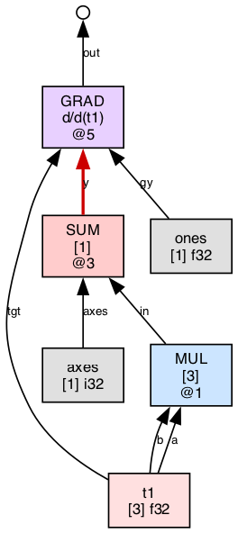

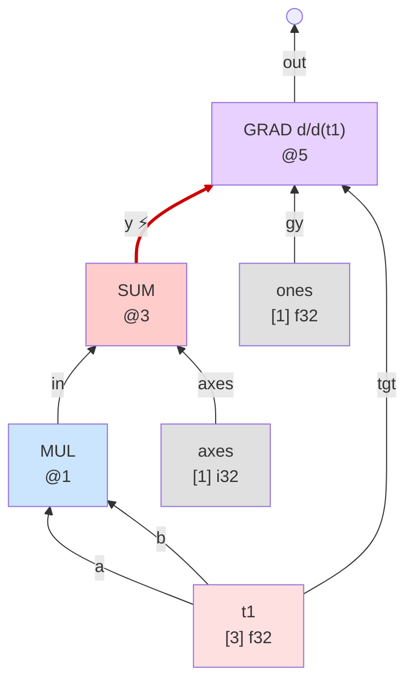

### step_001 — `GRAD ⊳ SUM` fires

SUM and the old GRAD are consumed.  A fresh GRAD slides to MUL; the
seed `ones` is wrapped in a new EXPAND to match MUL's shape `[3]`.

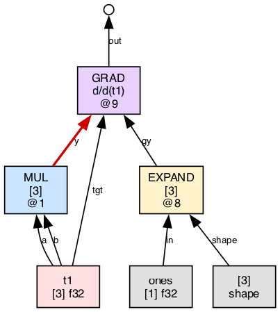

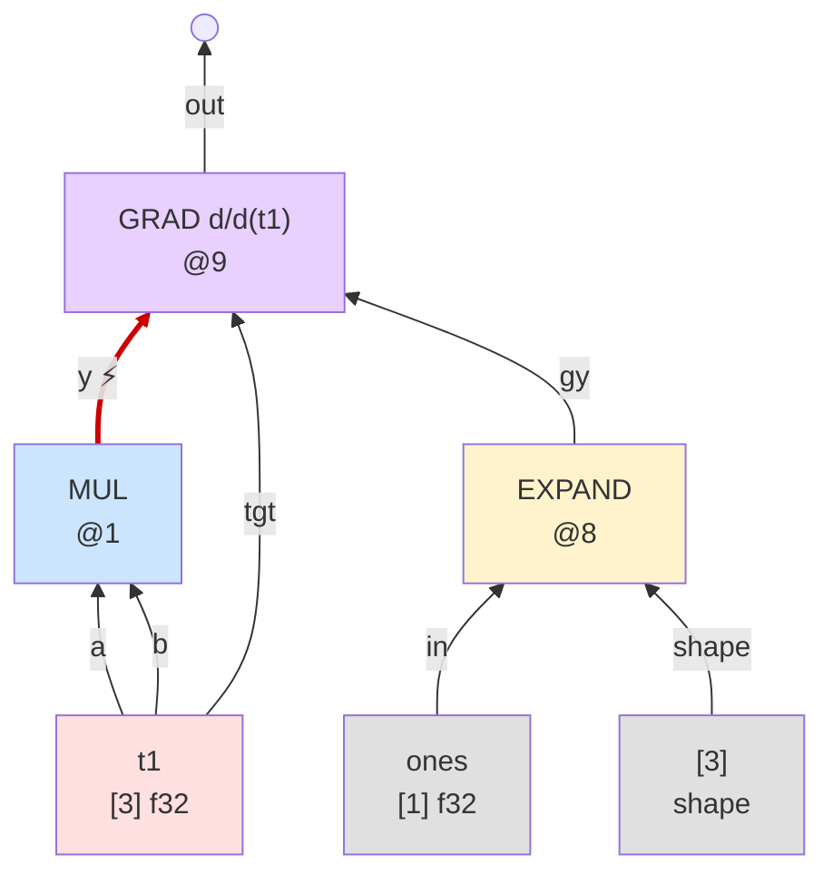

### step_002 — `GRAD ⊳ MUL` fires (binary Leibniz)

MUL is consumed.  Two sub-GRADs appear, one per operand of MUL.  Each
cotangent cross-multiplies with the other operand.  The incoming
`EXPAND` cotangent is `DUP`'d to feed both sub-GRADs.  An `ADD`
combines the two outputs and becomes the new free output.

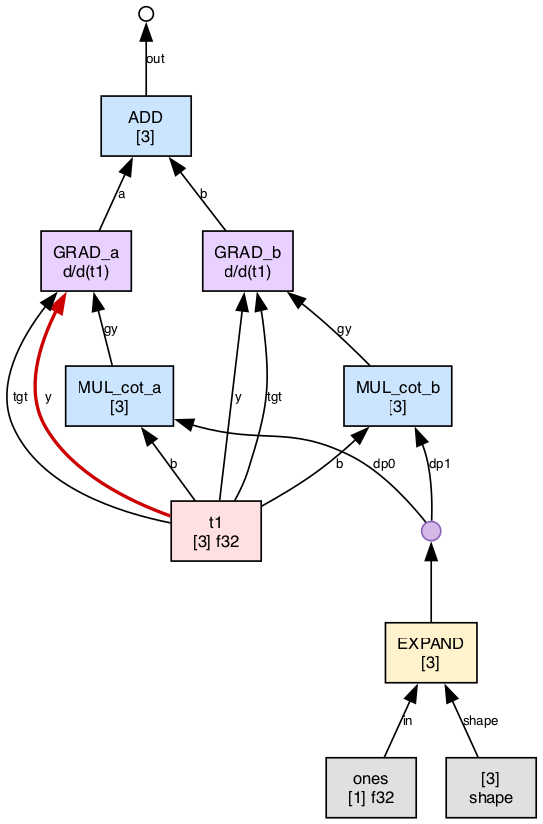

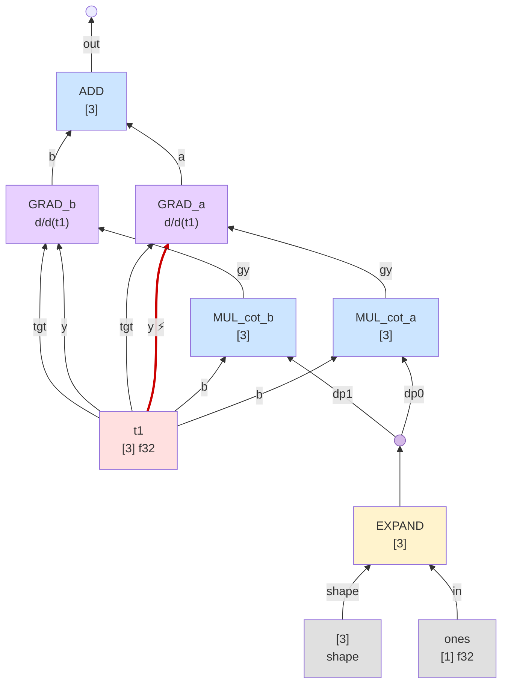

### step_003 — `GRAD ⊳ TEN` fires (left arm)

`t1 == tgt` match.  `GRAD_a` annihilates; its `gy` (MUL_cot_a) takes
GRAD_a's place in ADD.  The right arm's `t1 → GRAD_b` is the next redex.

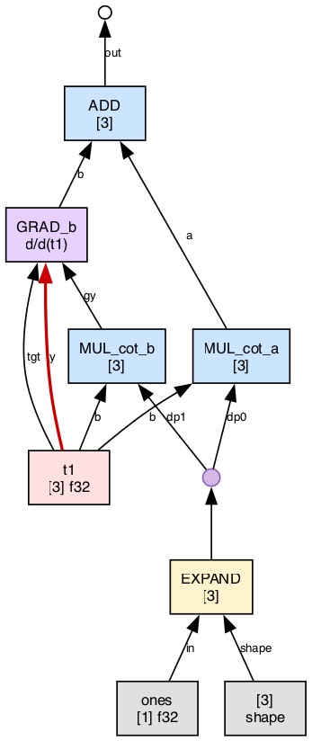

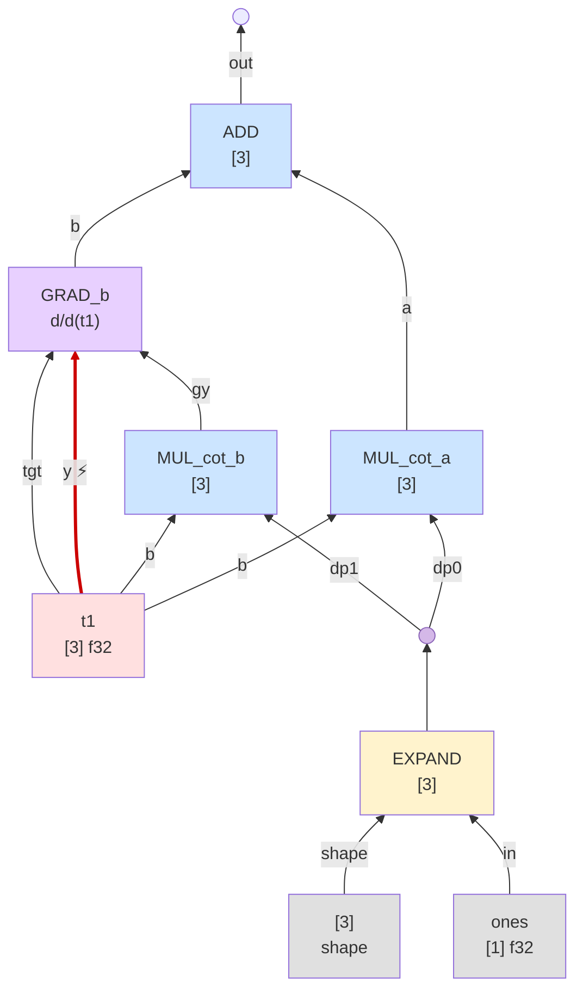

### step_004 — `GRAD ⊳ TEN` fires (right arm)

Same rule fires for `GRAD_b`.  Its position in ADD is replaced by
`MUL_cot_b`.  No GRAD nodes remain — the heap holds a pure backward
compute tree.

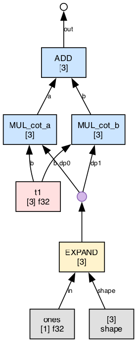

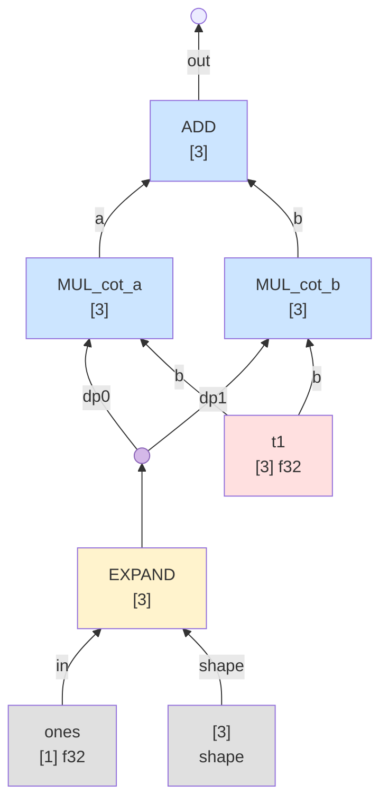

### step_005_final — FUSE compiles the bwd into a single kernel

The `ADD(MUL, MUL)` subtree with shared `EXPAND` source gets fused into
one kernel.  Its inputs are `t1` and `ones`; the body is
`ADD(MUL(EXPAND, t1), MUL(EXPAND, t1))`.  Running it produces
`[2, 4, 6]` — the gradient.

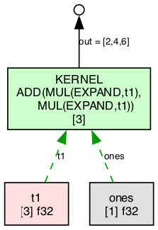

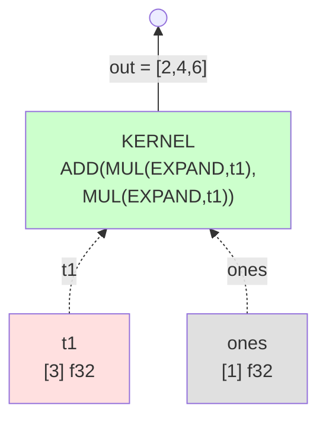

## Summary

| step      | nodes on heap                                                 | redex            |
|-----------|---------------------------------------------------------------|------------------|
| 000       | MUL, SUM, GRAD, t1, axes, ones                                | SUM → GRAD       |
| 001       | MUL, EXPAND, GRAD', t1, ones, shape                           | MUL → GRAD'      |
| 002       | DUP, 2× MUL_cot, EXPAND, 2× GRAD, ADD, t1, ones, shape        | t1 → GRAD_a      |
| 003       | DUP, 2× MUL_cot, EXPAND, 1× GRAD_b, ADD, t1, ones, shape      | t1 → GRAD_b      |
| 004       | DUP, 2× MUL_cot, EXPAND, ADD, t1, ones, shape                 | (none — bwd done)|
| 005_final | 1× KERNEL, t1, ones                                           | (none)           |

## Properties the refactor must preserve

1. **Persistent slide.**  Once `GRAD ⊳ SUM` fires, the new GRAD stays
   on MUL for subsequent steps.  No flicker.  The heap reflects the
   IC state at all times.

2. **Fresh cells for new GRADs.**  Each sub-GRAD (from binary rules)
   gets its own heap cell.  The original GRAD cell is ERA'd.

3. **Consumed forward nodes are ERA'd.**  After `GRAD ⊳ SUM` fires,
   SUM's heap cell is released.  The dumper sees no stale SUM.

4. **DUP only when sharing a non-atom.**  `gy` is a compute TOP →
   DUP'd for binary rules.  TEN atoms are aliased without DUP.

5. **Leaf annihilation.**  `GRAD ⊳ TEN` with matching target: the GRAD
   erases and its gy propagates as the output contribution.  Local
   rewrite — no frame, no stack.

6. **Value correctness.**  Final gradient is `[2, 4, 6]` for this
   example.  All current numeric tests (143/143) continue to pass.

## Implementation sketch

- `thvm_grad` allocates 3 slots: `{y, tgt, gy}`.  `gy` starts as
  `term_era()`.  `thvm_grad_with_gy` is the internal builder sub-rules
  use to produce new GRAD cells with a prepared cotangent.

- wnf's `UOP_GRAD` enter: if `gy` is ERA, seed with `ones(y.shape)`
  and write to slot 2.  Push a `WNF_F_VJP_IC` frame carrying only
  the GRAD's heap loc.  Descend into y for WHNF.

- Apply-phase for `WNF_F_VJP_IC`: dispatch on `whnf`'s head.
  - `TEN`: if match tgt → `whnf = gy`; else `whnf = term_era()`.
    ERA the GRAD cell.
  - Unary TOP (SUM/NEG/…): compute new_gy, mutate the GRAD cell in
    place (`y = operand, gy = new_gy`), push a fresh VJP_IC frame,
    `next = grad_term`, goto enter.
  - Binary TOP (MUL/ADD/…): allocate two fresh GRAD cells + one ADD
    cell, wire up, ERA old GRAD cell, `whnf = add_term`.

- Delete old `WNF_F_VJP`, `WNF_F_VJP_BIN1`, `WNF_F_VJP_BIN2` frame
  kinds.  Delete `VJP_RECURSE_INTO` and `VJP_BINARY` macros.

- The step-graph hook becomes trivial: just highlight the redex edge
  (always at `grad_slot+0`).  No slide hack, no restore.
