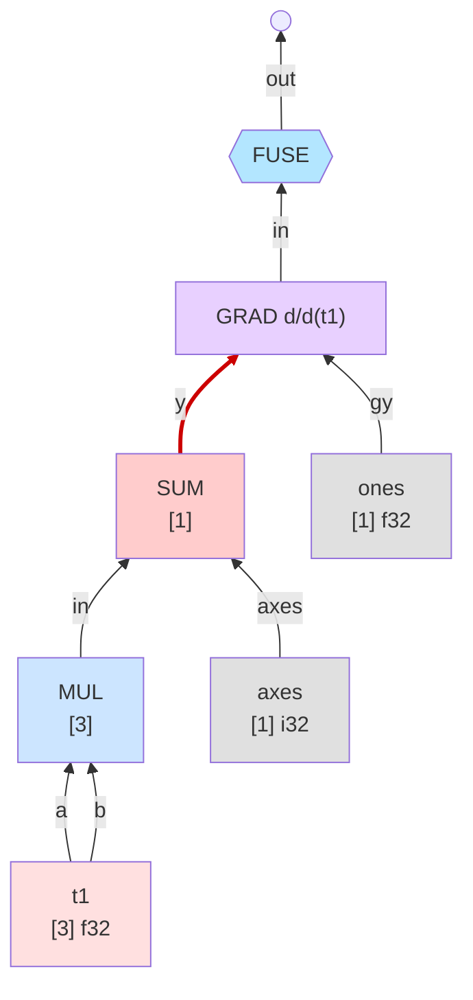
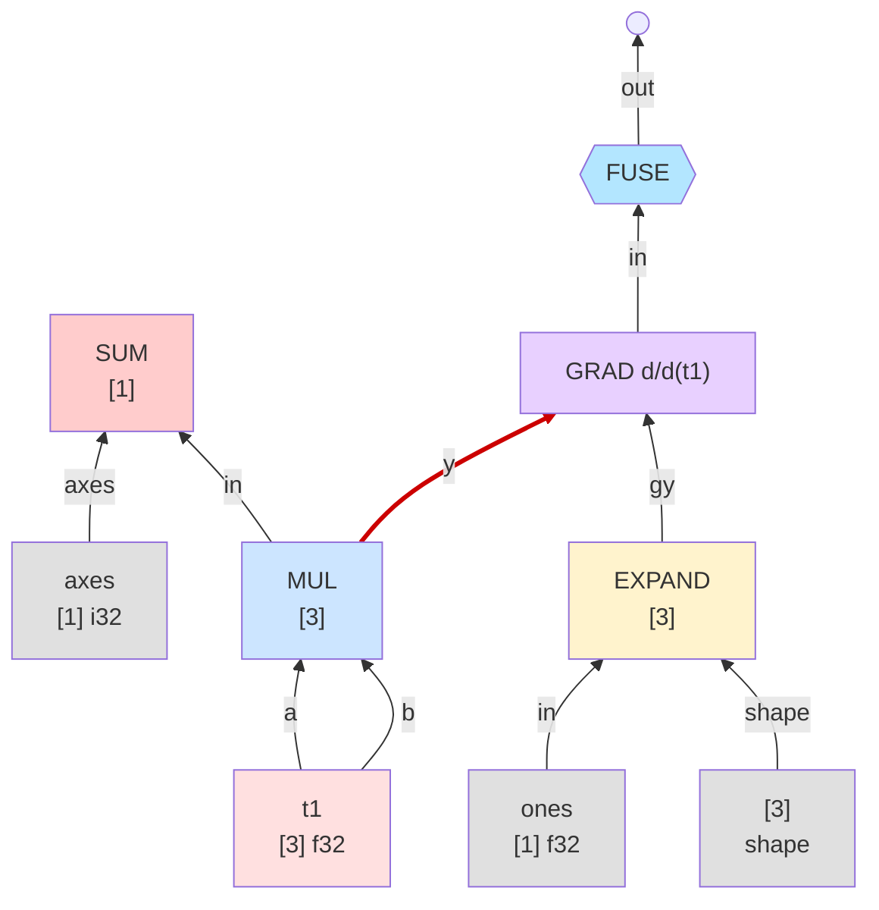
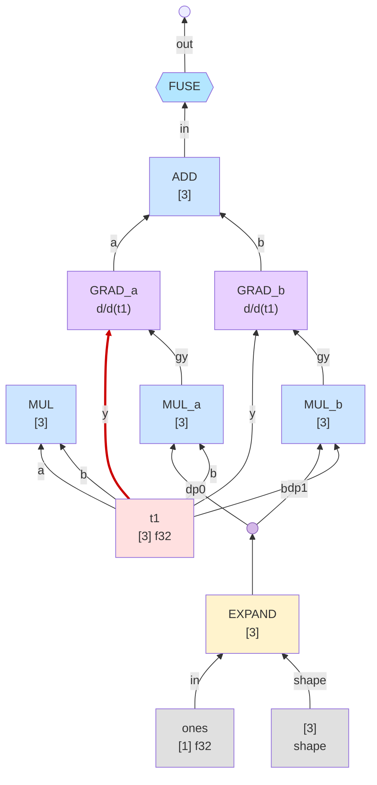

# Step-graph target: IC-native VJP interaction trace

Goal for the wnf VJP refactor.  Each step is one IC interaction.  The
redex (principal-port edge of the two interacting terms) is drawn red.
All mutations are persistent: a consumed node becomes forward history
(no longer a redex agent), sub-GRADs get fresh cells, leaf-annihilated
GRADs vanish.  No frames, no restore-after-dump hacks.

Dot sources + rendered PNGs live in [step_graph_ic_goal/](step_graph_ic_goal/).

Example: `vjp_sum_of_square`

```c
f32 xd[] = {1, 2, 3};
Term t1 = thvm_tensor(ctx, xd, SHAPE(3));
Term sq = thvm_op(ctx, UOP_MUL, t1, t1);
Term y  = thvm_sum_axes(ctx, sq, (u32[]){0}, 1);
thvm_eval(ctx, thvm_grad(ctx, y, t1));  // expect [2, 4, 6]
```

## GRAD term layout (IC)

A `GRAD` agent has 2 principal input ports and 1 output port:

- `y`  — the forward term being differentiated.  Connected to the
  principal port of whatever produced the scalar.  **This is the redex
  edge.**
- `gy` — the cotangent accumulator.  Outermost GRAD is seeded with
  `ones(y.shape)`.
- `out` — the contributed gradient.

The target tensor is carried in the GRAD's label only (`d/d(t1)`); it
never appears as an edge.  Leaf-annihilation matches the target against
whatever reduces at the `y` port.

## Per-rule rewrites

| head at `y`         | rewrite                                                                |
|---------------------|------------------------------------------------------------------------|
| `TEN == tgt`        | GRAD annihilates → `gy` becomes the output.                            |
| `TEN != tgt`        | GRAD annihilates to ERA.                                               |
| `SUM(a, axes)`      | GRAD slides to `a`; `gy ← EXPAND(gy, shape(a))`.                       |
| `MUL(a, b)`         | two sub-GRADs (y=a, y=b); cotangents `MUL(gy, b)` / `MUL(gy, a)`; ADD outputs. |
| `ADD(a, b)`         | two sub-GRADs (y=a, y=b); both share gy via DUP; ADD outputs.          |
| `NEG(a)`            | slide to `a`; `gy ← NEG(gy)`.                                          |
| `EXP(a)`            | slide to `a`; `gy ← MUL(gy, EXP(a))` (EXP reuses forward value).       |
| `LOG(a)`            | slide to `a`; `gy ← DIV(gy, a)`.                                       |
| … (RELU/SQRT/etc.)  | analogous unary wrap.                                                  |

Rules with a binary forward (MUL/ADD/SUB/DIV/MAX/…) always produce
**two fresh GRAD cells** plus an ADD combining their outputs.  Unary
rules **mutate** the GRAD cell in place: slide `y` to the forward's
operand, replace `gy` with the wrapped version.

`gy` is a compute TOP whenever a binary rule shares it — so a **DUP**
cell is allocated to fan it out.  `t1` (and other TEN leaves) are
aliased without DUP.

**FUSE is always at the root.**  It waits on GRAD to reduce, then
absorbs compute TOPs one at a time into a growing KERNEL bubble.
Forward-history nodes (SUM, MUL from the original forward pass) stay
visible outside the kernel — they're not redex agents anymore.

## Interaction trace for `vjp_sum_of_square`

Red edge = redex (the principal-port edge that's about to fire).

### step_000 — initial state

Forward `MUL → SUM` already built; `thvm_grad(y, t1)` wraps it with a
GRAD seeded to `ones([1])`; FUSE sits at the root waiting on GRAD.




### step_001 — `GRAD ⊳ SUM` fires

GRAD slides from SUM to MUL (SUM's argument).  SUM stays in the graph
as forward history.  `ones` is wrapped in a fresh EXPAND to match
MUL's shape `[3]`.  FUSE still waiting.




### step_002 — `GRAD ⊳ MUL` fires (binary Leibniz)

Two sub-GRADs appear, one per MUL operand (both are `t1` in this
example).  The incoming EXPAND cotangent is DUP'd; each sub-GRAD
cross-multiplies with the other operand.  An ADD combines the two
sub-GRAD outputs and sits below FUSE.  MUL stays as forward history.




### step_003 — `GRAD_a ⊳ TEN` fires

`t1 == tgt` match.  GRAD_a annihilates; its gy (MUL_a) takes GRAD_a's
place feeding ADD's a-port directly.  The right arm is next.


### step_004 — `GRAD_b ⊳ TEN` fires

Same rule for the right arm.  MUL_b feeds ADD's b-port.  No GRAD nodes
remain.  Next redex is the FUSE-at-root meeting ADD's principal port.


### step_005 — `FUSE ⊳ ADD` fires

ADD absorbed into a growing KERNEL bubble.  FUSE now has two principal
inputs (MUL_a, MUL_b) where ADD sat.


### step_006 — `FUSE ⊳ MUL_a` fires

Left MUL cotangent absorbed.  Kernel holds {ADD, MUL_a}; boundary
inputs: DUP.dp0, t1, MUL_b.


### step_007 — `FUSE ⊳ MUL_b` fires

Right MUL cotangent absorbed.  Kernel holds {ADD, MUL_a, MUL_b}; DUP
is now at the boundary.


### step_008 — `FUSE ⊳ DUP` fires

DUP absorbed.  Sharing is kernel-internal.  EXPAND is the last compute
TOP outside.


### step_009 — `FUSE ⊳ EXPAND` fires (final)

Every backward compute TOP is in the kernel.  Leaves (t1, ones, shape)
and forward-history nodes (MUL, SUM) remain outside.  No more redexes.
Running the kernel yields `[2, 4, 6]`.


## Summary

| step | just fired         | redex after            |
|------|--------------------|------------------------|
| 000  | (initial)          | SUM → GRAD             |
| 001  | GRAD ⊳ SUM         | MUL → GRAD             |
| 002  | GRAD ⊳ MUL         | t1 → GRAD_a            |
| 003  | GRAD_a ⊳ TEN       | t1 → GRAD_b            |
| 004  | GRAD_b ⊳ TEN       | ADD → FUSE             |
| 005  | FUSE ⊳ ADD         | MUL_a → FUSE           |
| 006  | FUSE ⊳ MUL_a       | MUL_b → FUSE           |
| 007  | FUSE ⊳ MUL_b       | DUP → FUSE             |
| 008  | FUSE ⊳ DUP         | EXPAND → FUSE          |
| 009  | FUSE ⊳ EXPAND      | (none — WHNF)          |

## Properties the refactor must preserve

1. **Persistent slide.**  Once `GRAD ⊳ SUM` fires, the GRAD is on MUL
   for subsequent steps.  The heap reflects the IC state at all times;
   no flicker, no restore-after-dump.

2. **Fresh cells for new GRADs.**  Each sub-GRAD (from binary rules)
   gets its own heap cell.  The parent GRAD cell is consumed.

3. **Forward history stays visible.**  Once a forward node has had its
   VJP rule fire, it's no longer a redex agent but its cell stays in
   the graph until the whole program finishes.  The dumper shows the
   full forward+backward trace.

4. **DUP only when sharing a non-atom.**  `gy` is a compute TOP →
   DUP'd for binary rules.  TEN atoms are aliased without DUP.

5. **Leaf annihilation.**  `GRAD ⊳ TEN` with matching target: the GRAD
   erases and its gy propagates as the output contribution.  Local
   rewrite — no frame, no stack.

6. **FUSE at root always.**  FUSE doesn't wait for GRAD to finish then
   suddenly appear; it's wrapping the root from step 0 and absorbs
   compute TOPs one interaction at a time as they become reachable.

7. **Value correctness.**  Final gradient is `[2, 4, 6]` for this
   example.  All current numeric tests (143/143) continue to pass.

## Implementation sketch

- `thvm_grad` allocates 2 slots: `{y, gy}`.  `gy` starts as
  `term_era()`.  Target is encoded in the GRAD head bits / label — not
  in a heap slot.

- wnf's `UOP_GRAD` enter: if `gy` is ERA, seed with `ones(y.shape)`
  and write to slot 1.  Push a `WNF_F_VJP_IC` frame carrying only
  the GRAD's heap loc.  Descend into y for WHNF.

- Apply-phase for `WNF_F_VJP_IC`: dispatch on `whnf`'s head.
  - `TEN`: if match tgt → `whnf = gy`; else `whnf = term_era()`.
    ERA the GRAD cell (sub-GRADs only; outermost GRAD reuses cell).
  - Unary TOP (SUM/NEG/…): compute new_gy, mutate the GRAD cell in
    place (`y = operand, gy = new_gy`), push a fresh VJP_IC frame,
    `next = grad_term`, goto enter.
  - Binary TOP (MUL/ADD/…): allocate two fresh GRAD cells + one ADD
    cell + DUP if gy non-atom, wire up, consume old GRAD cell,
    `whnf = add_term`.

- Delete old `WNF_F_VJP`, `WNF_F_VJP_BIN1`, `WNF_F_VJP_BIN2` frame
  kinds.  Delete `VJP_RECURSE_INTO` and `VJP_BINARY` macros.

- The step-graph hook becomes trivial: just highlight the current
  redex edge.  No slide hack, no restore.
