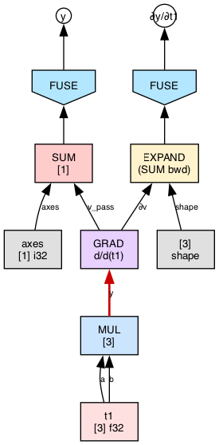
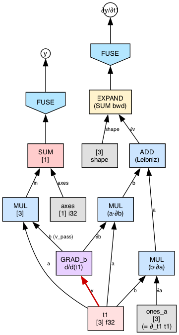
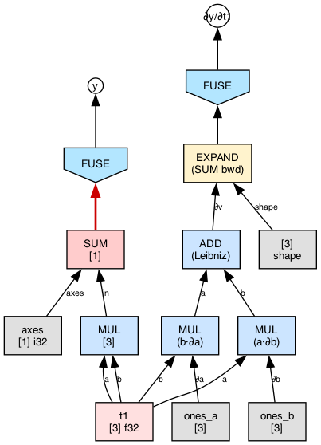
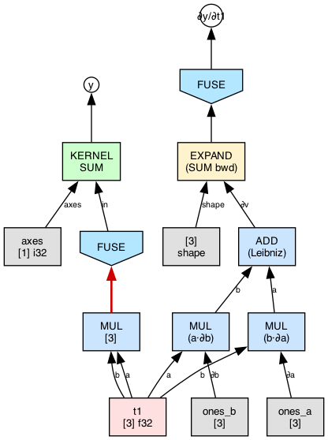
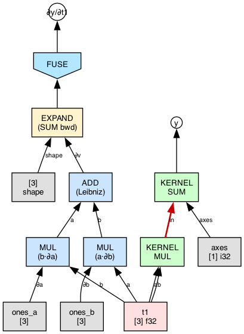
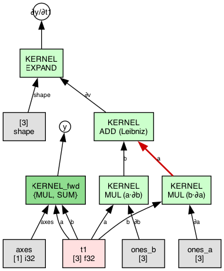

# Step-graph target: IC-native VJP interaction trace

Canonical step-by-step trace of `vjp_sum_of_square` under the IC-native
VJP rules.  Each step is one wnf interaction.  The redex (the principal
edge that is about to fire) is drawn in red.  All mutations are
persistent: consumed redex agents become forward history, sub-GRADs get
fresh cells, leaf-annihilated GRADs vanish.  No frames, no
restore-after-dump hacks.

The `.dot` sources and rendered PNGs live in
[step_graph_ic_goal/](step_graph_ic_goal/); they are produced by
`scripts/run_vjp_step_graph.sh png`.

Example source:

```c
f32 xd[] = {1, 2, 3};
Term t1 = thvm_tensor(ctx, xd, SHAPE(3));
Term sq = thvm_op(ctx, UOP_MUL, t1, t1);
Term y  = thvm_sum_axes(ctx, sq, (u32[]){0}, 1);
thvm_eval(ctx, thvm_grad(ctx, y, t1));  // expect [2, 4, 6]
```

## GRAD term layout (IC)

A `GRAD` agent is a **1-in/2-out T-junction**:

- **`y` (principal input)** — the forward term being differentiated.
  The redex edge is always incident on this port.
- **`v_pass` (output)** — the forward value being carried through.
  Feeds a dedicated forward FUSE (`FUSE_f`) that produces `y`.
- **`∂v` (output)** — the cotangent edge.  Feeds a dedicated backward
  FUSE (`FUSE_b`) that produces `∂y/∂target`.

The target tensor is carried in the GRAD's label only (`d/d(t1)`); it
never appears as an edge.  No concrete `ones` seed is drawn in the
initial state — cotangent leaves materialize lazily at `GRAD ⊳ TEN`
(leaf-annihilation), one `ones_<port>` per matching target read.

Both FUSEs wrap the root from step 0 and absorb compute TOPs one at a
time as they become reachable.

## Per-rule rewrites

The VJP rules match tinygrad's primal-to-backward recipes.  Each rule
reparents the GRAD around the interacting forward TOP: `v_pass`
continues through the forward operator, `∂v` gets wrapped in the
operator's adjoint.

| head at `y`         | v_pass rewrite                     | ∂v rewrite                                  |
|---------------------|------------------------------------|---------------------------------------------|
| `TEN == tgt`        | aliases to the TEN                 | materializes `ones(tgt.shape)`              |
| `TEN != tgt`        | aliases to the TEN                 | erases                                      |
| `SUM(a, axes)`      | feeds `a → SUM → v_pass_out`       | `EXPAND(∂v, a.shape)` (tinygrad: REDUCE_AXIS(ADD) bwd is EXPAND only) |
| `MUL(a, b)`         | two sub-GRADs (one per operand); each v_pass feeds the original MUL | chain-MUL: left emits `b·∂a`, right emits `a·∂b`; ADD sums them |
| `ADD(a, b)`         | two sub-GRADs                      | both share `∂v` (via DUP if non-atom); no chain mul |
| `NEG(a)`            | slide to `a`                       | `NEG(∂v)`                                   |
| `EXP(a)`            | slide to `a`                       | `MUL(∂v, EXP(a))`                           |
| `LOG(a)`            | slide to `a`                       | `DIV(∂v, a)`                                |
| … (RELU/SQRT/etc.) | analogous unary wrap               | analogous unary wrap                        |

Binary forwards (MUL/ADD/SUB/DIV/MAX/…) produce **two fresh GRAD
cells** plus an ADD combining the per-operand contributions.  Unary
rules mutate the GRAD in place: `y` slides to the forward's operand,
`∂v` is wrapped in the operator's adjoint.

`∂v` is a compute TOP whenever a binary rule shares it — a **DUP** cell
fans it out.  `t1` (and other TEN leaves) are aliased without DUP.

## Interaction trace for `vjp_sum_of_square`

Red edge = redex (the principal-port edge that is about to fire).

### step_000 — initial state

Forward `MUL → SUM` already built.  `thvm_grad(y, t1)` wraps the SUM
result with a GRAD T-junction.  `FUSE_f`/`FUSE_b` sit at the two roots
waiting on GRAD.  No concrete seed yet.


Redex: `SUM → GRAD` (principal y-edge).

### step_001 — `GRAD ⊳ SUM` fires

GRAD reparents **above** SUM.  `v_pass` now feeds SUM (forward
continues through to `FUSE_f`); `∂v` feeds a fresh `EXPAND(·, [3])`
which then feeds `FUSE_b`.  GRAD's `y` port is now on MUL.



Redex: `MUL → GRAD`.

### step_002 — `GRAD ⊳ MUL` fires (binary Leibniz)

Two sub-GRADs (`GRAD_a`, `GRAD_b`) on `t1`, each a 1-in/2-out
T-junction.  Each sub-GRAD's `v_pass` feeds the original forward MUL
(carrying `t1` through the `a` / `b` port).  Each sub-GRAD's `∂v` feeds
a **chain MUL** that multiplies the cotangent by the *other* operand
(left: `b·∂a`; right: `a·∂b`).  An `ADD_leib` sums the two chain MULs
into `∂v` at the MUL level, which feeds the outer EXPAND.  `t1` is a
TEN atom — aliased into all four consumers without DUP.


Redex: `t1 → GRAD_a` (left sub-GRAD's principal y-edge).

### step_003 — `GRAD_a ⊳ TEN(t1)` fires (target match)

Leaf-annihilation: `t1 == tgt`.  GRAD_a vanishes.  Its `v_pass` output
aliases directly to `t1` (feeding forward MUL's `a` port).  Its `∂v`
output materializes `ones_a[3]` — the first concrete cotangent leaf in
the graph — which feeds `MUL_ca`'s `∂a` port.



Redex: `t1 → GRAD_b` (symmetric right arm).

### step_004 — `GRAD_b ⊳ TEN(t1)` fires (target match)

Same rule for the right arm.  `ones_b[3]` materializes into
`MUL_cb`'s `∂b` port.  No GRAD agents remain.  Graph is now a pure
forward + backward compute tree, ready for FUSE kernelisation.



Redex: `SUM → FUSE_f` (first forward TOP to absorb).

### step_005 — `FUSE_f ⊳ SUM` fires (forward kernelisation begins)

`SUM` becomes `KERNEL_SUM`.  A fresh `FUSE_f` spawns on `SUM`'s compute
input (axes is metadata, passes through without a FUSE).



Redex: `MUL → FUSE_f` (forward MUL is next).

### step_006 — `FUSE_f ⊳ MUL` fires

Forward `MUL` becomes `KERNEL_MUL`.  Its inputs are `t1` (TEN leaves);
`FUSE ⊳ TEN` annihilates, so `t1` aliases directly into `KERNEL_MUL`
without spawning new FUSEs.  The graph now has two adjacent forward
KERNELs sharing a principal edge.



Redex: `KERNEL_MUL → KERNEL_SUM` (K ⊳ K merge).

### step_007 — `KERNEL_MUL ⊳ KERNEL_SUM` fires (forward merge)

The two forward kernels merge into `KERNEL_fwd` = `{MUL, SUM}`.
Forward is now a single kernel taking `(t1, axes)` and producing `y`.
Backward kernelisation starts next at EXPAND — the only backward TOP
directly adjacent to `FUSE_b`.


Redex: `EXPAND → FUSE_b`.

### step_008 — `FUSE_b` sweeps the backward subtree

`FUSE_b` absorbs every backward TOP as it reaches them: EXPAND, then
ADD_leib, then MUL_ca, then MUL_cb.  Each becomes a singleton
`KERNEL_*` node wired along its original principal edge.  The snapshot
shows the state after all four TOPs are singletons and the first K⊳K
redex is ready to fire (`KERNEL_MUL_ca → KERNEL_ADD`).



Redex: `KERNEL_MUL_ca → KERNEL_ADD` (one of several K⊳K redexes).

### step_009 — K⊳K cascade merges the backward subtree (final)

The backward KERNEL/KERNEL cascade merges all four singletons into
`KERNEL_bwd` = `{MUL_ca, MUL_cb, ADD, EXPAND}`.  Final state: exactly
two kernels — `KERNEL_fwd` producing `y`, `KERNEL_bwd` producing
`∂y/∂t1`.  Both share `t1` as a TEN leaf.  No more redexes — WHNF.
Running the kernels yields `y = [14]` and `∂y/∂t1 = [2, 4, 6]`.


## Summary

| step | just fired                          | next redex                        |
|------|-------------------------------------|-----------------------------------|
| 000  | (initial — GRAD T-junction wired)   | SUM → GRAD                        |
| 001  | GRAD ⊳ SUM (reparent above SUM)     | MUL → GRAD                        |
| 002  | GRAD ⊳ MUL (binary split)           | t1 → GRAD_a                       |
| 003  | GRAD_a ⊳ TEN(t1), ones_a born       | t1 → GRAD_b                       |
| 004  | GRAD_b ⊳ TEN(t1), ones_b born       | SUM → FUSE_f                      |
| 005  | FUSE_f ⊳ SUM                         | MUL → FUSE_f                      |
| 006  | FUSE_f ⊳ MUL                         | KERNEL_MUL → KERNEL_SUM           |
| 007  | K ⊳ K (forward merge)                | EXPAND → FUSE_b                   |
| 008  | FUSE_b sweep (EXPAND, ADD, MUL_ca, MUL_cb) | KERNEL_MUL_ca → KERNEL_ADD |
| 009  | K ⊳ K cascade (backward merge)       | (none — WHNF)                     |

## Properties the refactor must preserve

1. **Persistent slide.**  Once `GRAD ⊳ SUM` fires, GRAD is on MUL for
   subsequent steps.  The heap reflects the IC state at all times; no
   flicker, no restore-after-dump.

2. **Fresh cells for new GRADs.**  Each sub-GRAD from a binary rule
   gets its own heap cell.  The parent GRAD cell is consumed.

3. **Forward history stays visible.**  A forward node that has had its
   VJP rule fire is no longer a redex agent, but its cell stays in the
   graph until the whole program finishes.  The dumper shows the full
   forward + backward trace.

4. **DUP only when sharing a non-atom.**  `∂v` is a compute TOP when a
   binary rule shares it → DUP'd.  TEN atoms are aliased without DUP.

5. **Lazy cotangent seeds.**  No `ones` nodes exist until a
   `GRAD ⊳ TEN` with matching target fires; each match materializes its
   own `ones_<port>` at the point of contact.

6. **Dual FUSE at root.**  `FUSE_f` and `FUSE_b` wrap the GRAD
   T-junction's two outputs from step 0 and kernelise compute TOPs one
   interaction at a time as they become reachable.  Neither waits for
   GRAD to finish before starting.

7. **Value correctness.**  Final `∂y/∂t1 = [2, 4, 6]` for this
   example.  All current numeric tests continue to pass.

## Implementation sketch

- `thvm_grad` allocates a GRAD cell whose slot 0 holds `y`.  The
  target is encoded in the TOP head bits (label `d/d(tgt)`), not in a
  heap slot.

- `thvm_trace_step_graph_session` (src/schedule/_.c) wraps the GRAD
  root in `FUSE_f` (forward output) and `FUSE_b` (backward output)
  before driving reduction; both are heap-resident so the dumper
  (include_all=1) walks them.

- wnf's VJP_RECURSE_INTO rewrites, for each `GRAD ⊳ TOP` rule:
  - Unary TOP (SUM/NEG/…): reparent the GRAD cell above the TOP.
    `v_pass` now feeds the TOP; `∂v` is wrapped in the TOP's adjoint.
  - Binary TOP (MUL/ADD/…): allocate two fresh sub-GRAD cells, wire
    their `v_pass` ports back into the original forward TOP, wire their
    `∂v` ports through chain-MULs (MUL case) or shared-DUP (ADD case)
    into an ADD_leib that feeds the parent ∂v.
  - `TEN`: match target → alias `v_pass` to the TEN, materialize
    `ones_<port>` on `∂v`, erase the GRAD.  Non-match → erase entirely.

- Phase-1 of `thvm_trace_step_graph_session` runs `thvm_reduce` +
  `thvm_normalize` with `g_thvm_defer_fuse_kernelize = 1` — GRAD
  commutes fire first, matching the spec's steps 000..004.  Phase-2
  runs the explicit `thvm_eval_fuse_fixed_point` — FUSE_f/FUSE_b
  kernelisation fires, matching steps 005..009.

- The step-graph hook (`wnf_step_session_hook`) renames each pending
  frame with the rule that just fired and edits the highlight to point
  at the next redex's principal edge.
