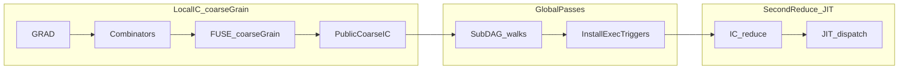

# Public Kernel DAG Redesign

**Source:** living design from local planning; kept in-repo for architecture and phased implementation.

## Goal

Three-layer story:

1. **Local IC phase** — `GRAD`, combinators, and all **local** interactions including **`FUSE` as coarse-graining**: between **fusion boundaries** (combinators, `DUP`/share points, non-compute consumers, effects, etc.), merge everything **compute-like** into coarser public structure. The heap can host **multiple** such regions; **each region’s compute slice is a DAG**, but the **overall interaction net is not a DAG in general** (sharing, loops, control, superposition). After **all local reductions** settle, you have a **public coarse-grained IC**: still an IC net, but with larger kernel-shaped nodes between boundaries — not “one global kernel DAG” for the whole program.

2. **Global compiler passes** (tinygrad-style, **not** the same as local IC reduction) — **separated, named** passes (WL-inspectable) that walk **subDAGs** (within or across coarse regions as defined by the pass) and **rewrite** them into **active, non-WNF, triggerable events** — the analogue of tinygrad **ExecItems**: nodes that exist precisely so a later reduction can **fire** dispatch/JIT when demanded. These passes may normalize, optimize, attach memory plans, bind backends, etc., but their **output** is IC-shaped **exec triggers**, not “already run GPU work” hidden from the net.

3. **Second IC reduce + JIT** — ordinary `thvm_reduce` (or eval) on the augmented net: interactions on ExecItem-like nodes perform **JIT / codegen / dispatch** and consume triggers until WNF or quiescence as defined for that mode.

**Future (phase 2 — multi-backend compilation):** Once the global-pass layer and exec-trigger **second reduce** path are stable, that phase is the natural place to **compile networks or regions** to **multithreaded C, Metal, CUDA**, and similar targets—**in spirit akin to Bend2** (explicit parallel / backend lowering from the visible net contract), rather than hiding such lowering inside fusion or ad-hoc walks over raw `TAG_TOP` inside fused regions.

Terminology: **`FUSE` = coarse-graining** (local). **Global passes = lowering the coarse public net to executable triggers**. **`SEQ`**: retire as the *contractual* carrier of cross-region order once **edges** (or dedicated effect/exec links) subsume it; internal bridge only during migration if needed.

This keeps the public story honest: no hidden post-fusion walk over raw UOP trees inside a fused region; boundaries match the real net; global work is visible as **installed exec triggers** plus a **second** reduction story.

## Ground truth in current code

- [`src/ctx/init.c`](../../src/ctx/init.c) — `linear_use()` applied to UOP inputs from `thvm_op()` was the constructor-time source of automatic UOP DUP insertion (now removed: `thvm_op` delegates to `thvm_op_raw`).
- [`src/fuse/_.c`](../../src/fuse/_.c) — `fuse_deref_links()` strips `DP0` / `DP1`, so the active fuser still walks through shared producers.
- [`src/schedule/_.c`](../../src/schedule/_.c) — `thvm_eval_reduce_fused()` is the live eval path; legacy graph-wide scheduling in `sched_all()` still exists but is not called from normal eval.
- [`src/schedule/_.c`](../../src/schedule/_.c) — `sched_install_kernel()` serializes kernel deps into `SEQ` (total-order encoding targeted for eventual replacement by exec-trigger deps / edges).

## Design decisions

- UOP constructors do not introduce `DUP` automatically; sharing inside UOP graphs is by **shared heap references**.
- `DUP` / `DP0` / `DP1` become hard public fusion boundaries. The fuser and scheduler must not dereference through them to continue fusing.
- Combinators may still introduce `DUP` where semantics require duplication; that marks a boundary.
- **Multiple compute subDAGs** between boundaries; **within** a fused region prefer edges over `SEQ` once encoding exists.
- **Global passes** install ExecItem-like nodes; **second reduce** performs JIT/dispatch.

## Mermaid (layers)

## Workstreams

1. **Remove constructor-time UOP linearity** — `thvm_op` → `thvm_op_raw` path (done for default UOP build); audit `TinyHVM.no_dup` in [`src/tinyhvm.h`](../../src/tinyhvm.h); recheck shape helpers that treat `DP` as transparent.
2. **Make `DUP` a real compute boundary** — interact rules, [`src/fuse/_.c`](../../src/fuse/_.c), [`src/schedule/_.c`](../../src/schedule/_.c) DP readiness.
3. **Coarse public IC** — recursive `UOP_KERNEL` contract; remove hidden flattening seam in [`src/interact/_.c`](../../src/interact/_.c) where appropriate.
4. **Global passes → ExecItem-like triggers** — named C/WL entry points; output non-WNF triggers.
5. **Dependencies** — DAG inside regions; edges across boundaries; second reduce.
6. **Lowering, cache, debug** — [`src/lower/_.c`](../../src/lower/_.c), [`docs/kernel_cache.md`](../kernel_cache.md), [`src/debug/dump.c`](../../src/debug/dump.c), [`src/debug/graph.c`](../../src/debug/graph.c).
7. **Documentation / WL** — eval, fusion, dependencies, memory; [`wl/CSource/tinyhvmlink.m`](../../wl/CSource/tinyhvmlink.m), [`wl/Kernel/TinyHVM.wl`](../../wl/Kernel/TinyHVM.wl).

## Verification strategy

- Extend visible-kernel traces ([`test/test_fuse_kernel_visible.m`](../../test/test_fuse_kernel_visible.m)): public graph shows nested/shared `UOP_KERNEL`, not raw `MUL`/`ADD` inside fused regions.
- Sharing test: one lazy tensor feeds two UOP consumers without constructor-time DUP.
- DUP-boundary regression: fuser does not absorb through `DP0`/`DP1`.
- Two disjoint coarse regions; effect-order via edges once migration complete.

## Implementation todos (tracking)

- [x] DUP/DP0/DP1 as hard public fusion boundary (fuser + scheduler).
  - `fuse_walk_inner` returns -1 on DP0/DP1 (hard boundary, no peek-through).
  - View-through-DP special case removed; TAG_VAR still derefs.
  - `sched_unwrap_views` stops at DP; `sched_collect_boundaries` marks shared children as external.
- [x] Recursive public `UOP_KERNEL` contract per region; flattening seam.
  - `thvm_kernel_to_compute` uses cached results instead of recursive flattening.
  - `thvm_kernel_child_ready` returns 0 for undispatched UOP_KERNEL children.
  - New `thvm_kernel_child_resolve` helper looks up kid_results for child kernels.
- [x] Global post-fusion compiler passes + ExecItem-like installs + second reduce.
  - `UOP_EXEC` (tag 33): executable kernel trigger with heap `[NUM(kid), deps, NUM(flags)]`.
  - `ThvmCompilerPass` function pointer type; `thvm_register_pass()` API.
  - `thvm_run_global_passes()` runs passes between fuse and second reduce.
  - `thvm_eval` now: reduce → fuse → global passes → second reduce (if passes registered).
- [x] DAG deps inside regions; deprecate `SEQ` as cross-region contract.
  - `sched_install_kernel` encodes deps as right-nested CTR chains in kernel heap slot 0.
  - `thvm_build_exec_trigger` helper for UOP_EXEC with CTR deps.
  - Legacy SEQ wrapping kept for backward compat until UOP_KERNEL handles CTR deps natively.
- [x] Debug, cache, regression tests for both layers.
  - UOP_EXEC arity (3) added to `thvm_uop_storage_arity`.
  - DOT renderer shows EXEC nodes with light blue color and kid label.
  - All existing tests pass: visible kernel, epoch redispatch, multiview lowering, phase1 loop.
- [ ] Docs + WL named passes.
